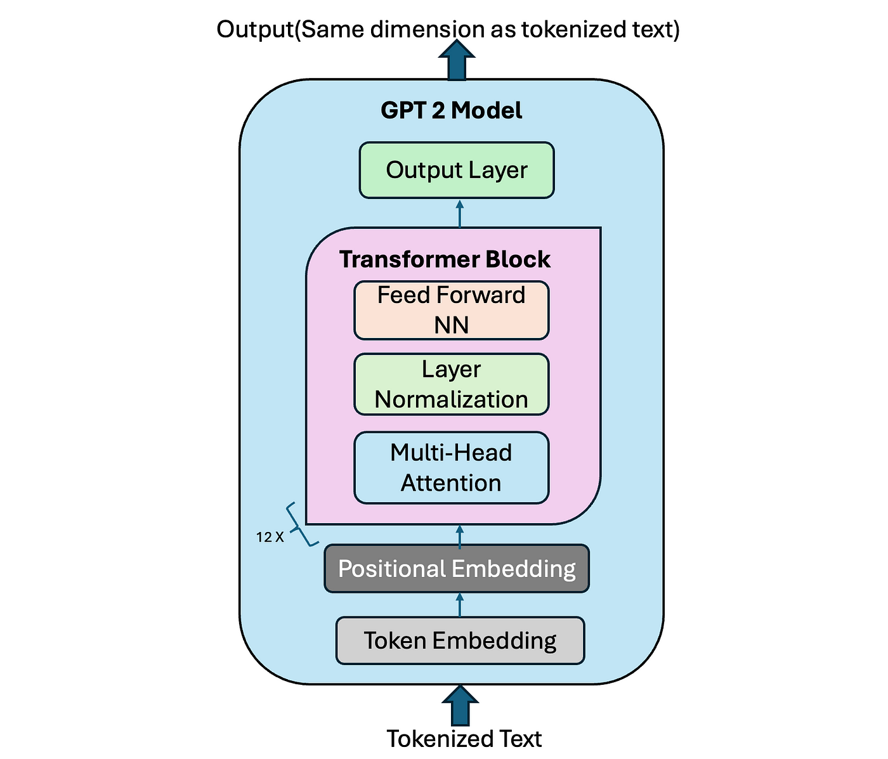
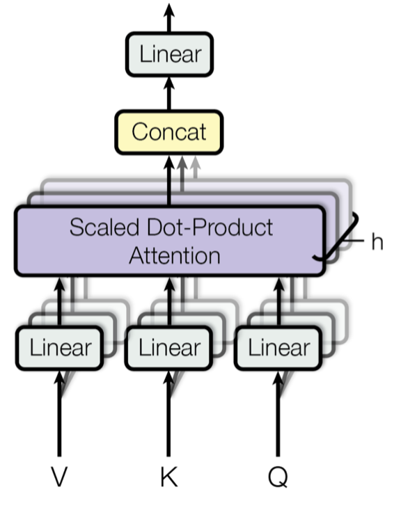
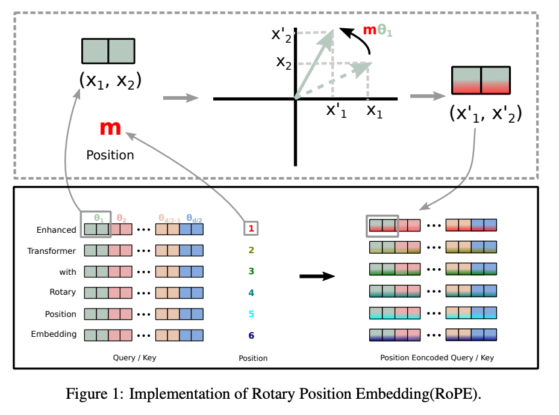

[Русский](README.md) | [English](README_EN.md)
# GPTFromScratch

Реализация модели GPT-2 с нуля на PyTorch.

## Ключевые технологии

### 1. Архитектура GPT-2
Реализация оригинальной архитектуры из работы:  
[**Language Models are Unsupervised Multitask Learners**](https://cdn.openai.com/better-language-models/language_models_are_unsupervised_multitask_learners.pdf)  
Особенности:
- Трансформерный декодер с многослойными вниманиями
- Генерация текста с авторегрессионным подходом
- Масштабируемая архитектура для различных размеров модели

### 2. Multi-Head Attention (MHA)
Оптимизированная реализация механизма внимания:  
[**Attention Is All You Need**](https://arxiv.org/pdf/1706.03762v7.pdf)

  
  

- Масштабированное скалярное произведение (Scaled Dot-Product)
- Параллельные вычислительные головы
- Эффективная матричная оптимизация

### 3. Rotary Positional Embedding (RoPE)
Передовое позиционное кодирование из работы:  
[**RoFormer: Enhanced Transformer with Rotary Position Embedding**](https://arxiv.org/pdf/2104.09864)

- Вращательные матрицы для кодирования позиций
- Сохранение относительных позиционных отношений
- Повышенная эффективность для длинных последовательностей

## Результаты
1. Создан датасет [simple_algebra_1m](https://huggingface.co/datasets/ozlobin/simple_algebra_1m) для тестирования крошечных LM

## Источники и ссылки
1. Базовый пример реализации GPT:  
   [minGPT от karpathy](https://github.com/karpathy/minGPT)
2. Теория масштабирования языковых моделей (полезно для подбора гиперпараметров):  
   [Scaling Laws for Neural Language Models](https://arxiv.org/pdf/2001.08361)
3. Датсеты и токенизаторы взяты отсюда:  
   [Hugging Face Hub](https://huggingface.co/)

---