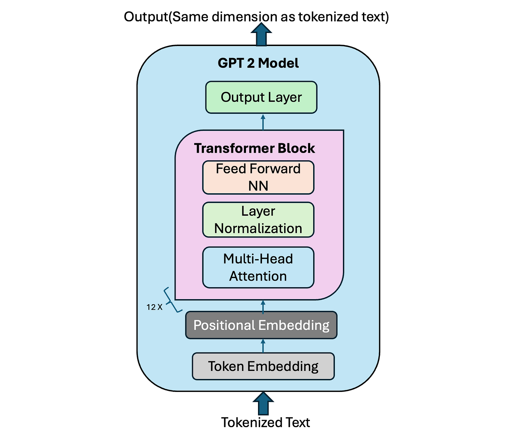

[Русский](README.md) | [English](README_EN.md)
# GPTFromScratch

From-scratch GPT-2 implementation in PyTorch with modern enhancements.

## Key Technologies

### 1. GPT-2 Architecture
Implementation of original architecture from:  
[**Language Models are Unsupervised Multitask Learners**](https://cdn.openai.com/better-language-models/language_models_are_un_supervised_multitask_learners.pdf)  
Features:
- Transformer-based decoder with multi-layer attention
- Autoregressive text generation
- Scalable architecture for different model sizes

### 2. Multi-Head Attention (MHA)
Optimized attention mechanism implementation:  
[**Attention Is All You Need**](https://arxiv.org/pdf/1706.03762v7.pdf)

  
  

- Scaled dot-product attention
- Parallel computation heads
- Efficient matrix optimization

### 3. Rotary Positional Embedding (RoPE)
Advanced positional encoding from:  
[**RoFormer: Enhanced Transformer with Rotary Position Embedding**](https://arxiv.org/pdf/2104.09864)

- Rotary matrices for position encoding
- Relative positional relationships preservation
- Enhanced efficiency for long sequences

## Implementation Highlights
- Pure PyTorch implementation with modular design
- Modern training optimizations (FlashAttention, mixed precision)
- Hugging Face datasets integration
- Configurable hyperparameters

## Results
1. A dataset named [simple_algebra_1m](https://huggingface.co/datasets/ozlobin/simple_algebra_1m) has been created for testing small language models. 

## Resources
1. Minimal GPT implementation reference:  
   [karpathy/minGPT](https://github.com/karpathy/minGPT)
2. Scaling laws for language models (hyperparameter tuning):  
   [Scaling Laws for Neural Language Models](https://arxiv.org/pdf/2001.08361)
3. Datasets & tokenizers:  
   [Hugging Face Hub](https://huggingface.co/)

---
